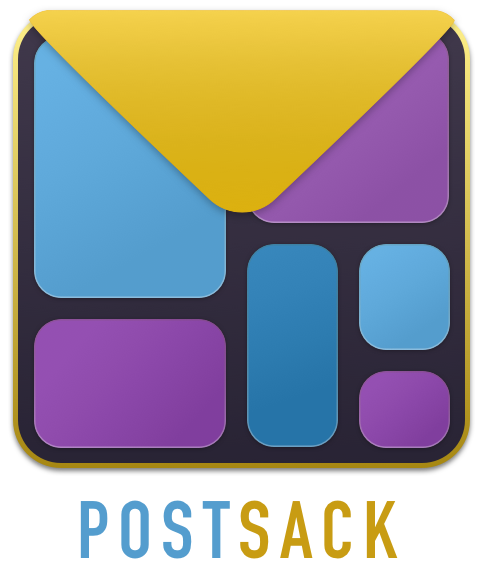
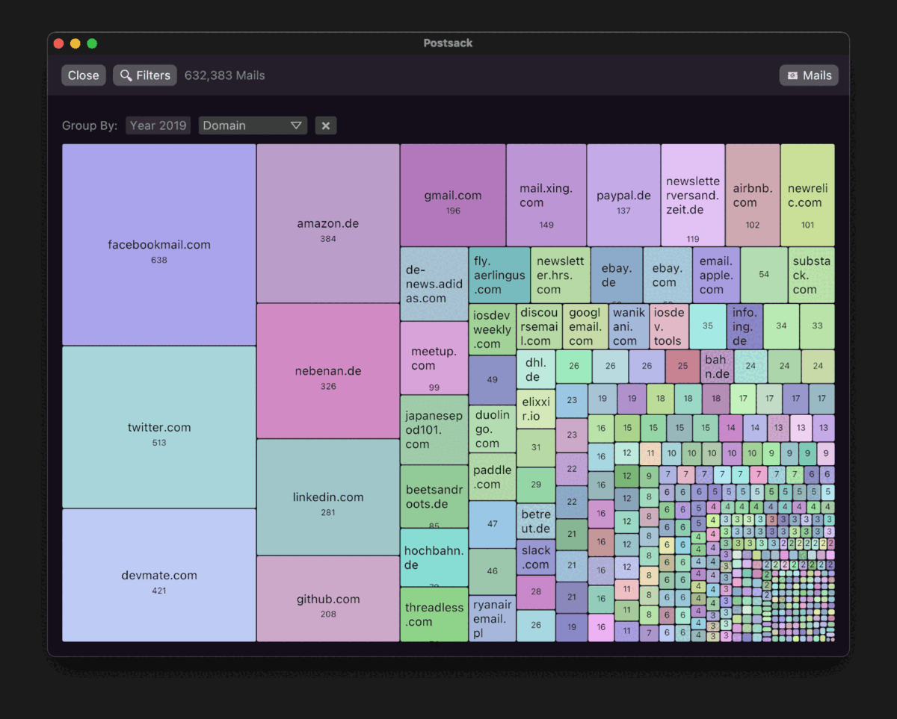

# Postsack

## A high level visual overview of swaths of email

[TLDR! A web demo that shows how Postsack clusters a set of 10.000 fake emails](https://terhech.de/postsack_demo)

Do you have many emails? I have a lot of emails. I'm not a inbox zero person. I recently realized that my Gmail account contains roughly 650.000 emails. I looked at that and I began
to wonder.. *Why?*..
Sure, I've been using Gmail since 2004 but still, that's 38.000 Emails per year which strikes me as a bit
on the crazy side of things. I wanted to know where these mails came from.

Gmail did not offer an easy way of visualizing all my emails, I also couldn't find a tool for it. Hence I
build my own. It parses all your mails and shows configurable clusters of mails in a nice visualization.

## It looks like this

## Features

- Written in Rust: Very fast email parsing / import. My **650k mails are imported in ~1 Minute** on a Macbook M1 Pro Max and ~ 2 Minutes on a Intel Core i7-8700B 3.2 Ghz.
- Import all your local mails (currently, only MBox, Apple Mail and Gmail Backups are supported)
- Build up clustered visualizations of your mails to see and understand what kind of emails you have
- Cluster the emails by sender domain / name, month, day, year, name, and some more
- Additional filters for seen mails or tags / labels
- See all the mails for the current set of filters / current cluster
- Save the generated database as a SQLite file so you can do additional queries yourself (or open it again)
- Cross platform (macOS, Windows, Linux and a [Web Demo](https://terhech.de/postsack_demo))
- The app is 13MB big and consumes ~150MB of memory on macOS

The look is similar on all platforms as it uses the [Rust egui](https://github.com/emilk/egui) GUI library.

## Videos

Here's a video showing the UI in action (e.g. me selecting some mail clusters)

https://user-images.githubusercontent.com/132234/146691524-d0a47c0f-b975-44b4-966c-5430d5784375.mp4

Here's another video where you can see the importer importer 650k mails (it is a bit boring but.)

https://user-images.githubusercontent.com/132234/146691534-6aa35159-0f77-472a-b5d1-7e159d64ab9e.mp4

## Web Demo

In addition to that, you can also [play around with some fake data in this Postsack Web Demo](https://terhech.de/postsack_demo)

## Using It

Currently, Postsack supports three different types of mail storage:

- MBox files [though with some issues](https://github.com/terhechte/postsack/issues/19)
- Apple Mail
- [GMVault](http://gmvault.org) GMail backups [though that could also be included natively](https://github.com/terhechte/postsack/issues/23)

There're open issues for other formats such as [maildir](https://github.com/terhechte/postsack/issues/18), [notmuch](https://github.com/terhechte/postsack/issues/17) or [Outlook](https://github.com/terhechte/postsack/issues/3) but if you use one of these formats your best bet would be to export your emails as MBox which seems to be something most mail apps support. Alternatively, I'd be more than happy for PR's implementing additional Mail Storage Formats.

If you have mails in any of the archives above, you can start Postsack select the folder with the emails
and it will do the rest.

## Current State

I've created issues for some of the missing functionality. Most importantly more email formats (as explained above). Beyond that, there're probably bugs, there's a certain lack of tests and documentation, the [windows build is on shaky grounds](https://github.com/terhechte/postsack/issues/20), [the light theme is wonky](https://github.com/terhechte/postsack/issues/15), [some parts need a healthy refactoring to be useful beyond Postsack](https://github.com/terhechte/postsack/issues/11), [and it would be great if the binaries could be generated from the Github actions](https://github.com/terhechte/postsack/issues/10).

## Deploying to crates.io for `cargo install`

One of the issues I ran into was that many of the emails I had received over the years were not
properly standards compliant. I forked [`email-parser`, email parser that Postsack is using](https://github.com/Mubelotix/email-parser/pull/11) in order to support all the weird issues I encountered. However,
this PR still needs a couple of enhancements before it will be merged into `email-parser`. Therefore,
Postsack is currently dependent on a fork of a crates.io crate. This means that I can't deploy this to
crates yet. Once The aforementioned pull request has been improved and merged, I will subsequently draft
a crates.io release.

## Overview

Here's an overview of the different crates in the Postsack Workspace:

- [ps-core](ps-core/src/lib.rs): Core types, traits and imports
- [ps-importer](ps-importer/src/lib.rs): Import different email formats into a database
- [ps-database](ps-database/src/lib.rs): Implemts the `ps-core::DatabaseLike` trait on top of SQLite
- [postsack-native](postsack-native): Builds the native (macOS, Linux, Windows) versions of Postsack
- [postsack-web](postsack-web): Builds [the web demo of Postsack](https://terhech.de/postsack_demo)

## Why Egui?

I had build an app in [Druid](https://github.com/linebender/druid) last year and I liked the experience.
This time I wanted to try out a different Rust gui library. Between [Iced](https://github.com/iced-rs/iced) 
and [Egui](https://github.com/emilk/egui) I went with the latter because the terse code examples were
tempting. Also, I had heard good things about it.

I might want to try to re-implement the postsack ui in another UI library. However something I really dig
about egui is how quickly it allows building a simple UI for a specific task (say you want to automate
a certain bash script). The main downside was that it is currently very limited in what it can do (e.g. available widgets, configuration, layout options, etc).

## What does `Postsack` mean?

[`Postsack` (or Postbeutel) is German](https://de.wikipedia.org/wiki/Postbeutel) for a bag full of mail